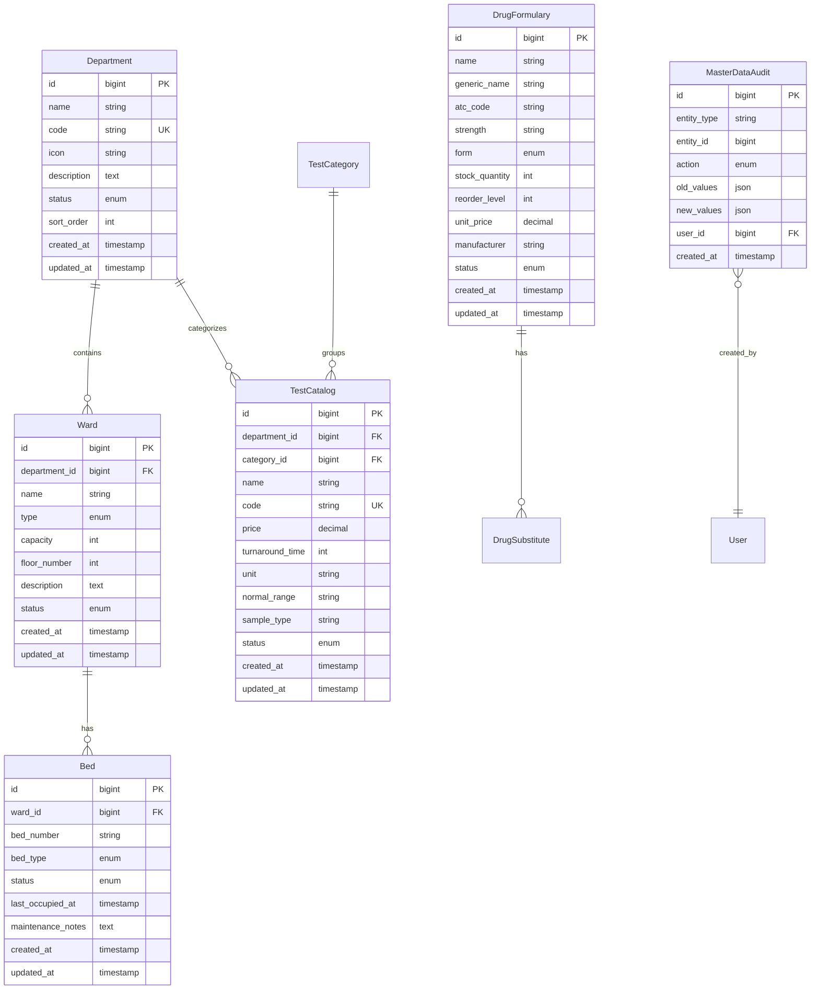

# Admin & Reporting System Design Document

## Overview

The Admin & Reporting system provides a comprehensive administrative interface for managing master data in the healthcare management system. Built on the existing Laravel + Inertia.js + React architecture, this system organizes administrative functions into three clear sections: Master Data, System Configuration, and Reporting & Analytics.

The design emphasizes intuitive UI patterns with visual data management interfaces including card grids, matrix views, and dynamic tables. The system follows the "setup once, referenced everywhere" principle for master data entities that form the foundation of the healthcare system.

## Architecture

### System Architecture Overview

```mermaid
graph TB
    subgraph "Presentation Layer"
        A[AdminDashboard.tsx] --> B[Navigation & Layout]
        C[MasterDataTabs.tsx] --> D[Tabbed Interface]
        E[DepartmentGrid.tsx] --> F[Card Grid with Inline Edit]
        G[BedMatrix.tsx] --> H[Excel-like Bed Management]
        I[TestCatalogTable.tsx] --> J[Searchable Test Management]
        K[DrugFormularyTable.tsx] --> L[Dynamic Drug Management]
    end
    
    subgraph "Controller Layer"
        M[AdminController.php] --> N[Dashboard & Navigation]
        O[MasterDataController.php] --> P[CRUD Operations]
        Q[DepartmentController.php] --> R[Department Management]
        S[WardController.php] --> T[Ward & Bed Management]
        U[TestCatalogController.php] --> V[Test Management]
        W[DrugFormularyController.php] --> X[Drug Management]
    end
    
    subgraph "Service Layer"
        Y[MasterDataService.php] --> Z[Business Logic Coordination]
        AA[DepartmentService.php] --> BB[Department Operations]
        CC[WardService.php] --> DD[Ward & Bed Operations]
        EE[TestCatalogService.php] --> FF[Test Catalog Operations]
        GG[DrugFormularyService.php] --> HH[Drug Formulary Operations]
    end
    
    subgraph "Data Layer"
        II[(Department)] --> JJ[departments table]
        KK[(Ward)] --> LL[wards table]
        MM[(Bed)] --> NN[beds table]
        OO[(TestCatalog)] --> PP[test_catalogs table]
        QQ[(DrugFormulary)] --> RR[drug_formulary table]
        SS[(MasterDataAudit)] --> TT[master_data_audits table]
    end
    
    A --> M
    C --> O
    E --> Q
    G --> S
    I --> U
    K --> W
    M --> Y
    O --> AA
    Q --> CC
    S --> EE
    U --> GG
    Y --> II
    AA --> KK
    CC --> MM
    EE --> OO
    GG --> QQ
```



### Technology Stack

- **Frontend**: React with TypeScript, Inertia.js, Tailwind CSS, Radix UI components
- **Backend**: Laravel 12+ with PHP 8.2+
- **Database**: MySQL/PostgreSQL with Eloquent ORM
- **UI Components**: Lucide React icons, Framer Motion animations
- **State Management**: Inertia.js reactive state with optimistic updates
- **Caching**: Redis for master data caching and performance optimization
- **Authentication**: Laravel Sanctum with role-based permissions (Spatie Laravel Permission)

## Components and Interfaces

### Frontend Components

#### AdminDashboard.tsx
**Purpose**: Main administrative interface with navigation and overview
- **Props Interface**:
  ```typescript
  interface AdminDashboardProps {
    user: User;
    permissions: string[];
    masterDataStats: {
      departments: number;
      wards: number;
      beds: number;
      tests: number;
      drugs: number;
    };
    recentActivity: AuditLog[];
  }
  ```
- **Key Features**: Three-section navigation (Master Data, System Config, Reporting), activity feed, quick stats
- **Navigation**: Tab-based interface with persistent state and breadcrumb navigation

#### MasterDataTabs.tsx
**Purpose**: Tabbed interface for master data management sections
- **Props Interface**:
  ```typescript
  interface MasterDataTabsProps {
    activeTab: 'departments' | 'wards' | 'tests' | 'drugs';
    onTabChange: (tab: string) => void;
    hasUnsavedChanges: boolean;
  }
  ```
- **Key Features**: Smooth tab transitions, unsaved changes warning, keyboard navigation
- **State Management**: URL-based tab state with browser history support

#### DepartmentGrid.tsx
**Purpose**: Card grid interface for departments and specialties management
- **Props Interface**:
  ```typescript
  interface DepartmentGridProps {
    departments: Department[];
    onUpdate: (id: number, data: Partial<Department>) => void;
    onDelete: (id: number) => void;
    onAdd: (data: CreateDepartmentData) => void;
  }
  
  interface Department {
    id: number;
    name: string;
    code: string;
    icon: string;
    status: 'active' | 'inactive';
    description?: string;
    created_at: string;
    updated_at: string;
  }
  ```
- **Key Features**: Card grid layout with icons, inline editing, status toggles, drag-and-drop reordering
- **UI Pattern**: Hover effects, smooth animations, optimistic updates

#### BedMatrix.tsx
**Purpose**: Excel-like matrix interface for ward and bed management
- **Props Interface**:
  ```typescript
  interface BedMatrixProps {
    wards: Ward[];
    beds: Bed[];
    occupancy: BedOccupancy[];
    onBedUpdate: (bedId: number, data: Partial<Bed>) => void;
    onWardUpdate: (wardId: number, data: Partial<Ward>) => void;
  }
  
  interface Ward {
    id: number;
    name: string;
    type: 'general' | 'icu' | 'maternity' | 'pediatric';
    capacity: number;
    current_occupancy: number;
  }
  
  interface Bed {
    id: number;
    ward_id: number;
    bed_number: string;
    bed_type: 'standard' | 'icu' | 'isolation';
    status: 'available' | 'occupied' | 'maintenance' | 'reserved';
  }
  ```
- **Key Features**: Color-coded bed status (green=free, red=occupied, yellow=maintenance), capacity bars, real-time updates
- **Interaction**: Click-to-edit bed details, ward capacity management, visual occupancy indicators

#### TestCatalogTable.tsx
**Purpose**: Searchable table for laboratory test management
- **Props Interface**:
  ```typescript
  interface TestCatalogTableProps {
    tests: TestCatalog[];
    categories: TestCategory[];
    onUpdate: (id: number, data: Partial<TestCatalog>) => void;
    onSearch: (query: string, filters: TestFilters) => void;
  }
  
  interface TestCatalog {
    id: number;
    name: string;
    code: string;
    category: string;
    price: number;
    turnaround_time: number;
    unit: string;
    normal_range?: string;
    status: 'active' | 'inactive';
  }
  ```
- **Key Features**: Filter chips by category, inline price/TAT editing, search with debouncing, bulk operations
- **Search**: Real-time filtering by name, code, or category with highlighted results

#### DrugFormularyTable.tsx
**Purpose**: Dynamic table for drug formulary management
- **Props Interface**:
  ```typescript
  interface DrugFormularyTableProps {
    drugs: DrugFormulary[];
    onUpdate: (id: number, data: Partial<DrugFormulary>) => void;
    onStockUpdate: (id: number, quantity: number) => void;
  }
  
  interface DrugFormulary {
    id: number;
    name: string;
    generic_name: string;
    atc_code: string;
    strength: string;
    form: string;
    stock_quantity: number;
    reorder_level: number;
    unit_price: number;
    substitutes: DrugSubstitute[];
    status: 'active' | 'discontinued';
  }
  ```
- **Key Features**: Stock badge color logic, substitute indicators, ATC code validation, price management
- **Stock Management**: Automated color coding (green=in stock, yellow=low, red=out), reorder alerts

### Backend Controllers

#### AdminController.php
**Responsibilities**: 
- Dashboard data aggregation
- Navigation state management
- Activity logging coordination

**Key Methods**:
```php
public function dashboard(): Response
public function getMasterDataStats(): JsonResponse
public function getRecentActivity(): JsonResponse
public function exportMasterData(string $type): BinaryFileResponse
```

#### MasterDataController.php
**Responsibilities**:
- Unified CRUD operations for master data
- Bulk operations and imports
- Data validation and integrity checks

**Key Methods**:
```php
public function index(string $type): JsonResponse
public function store(string $type, StoreMasterDataRequest $request): JsonResponse
public function update(string $type, int $id, UpdateMasterDataRequest $request): JsonResponse
public function destroy(string $type, int $id): JsonResponse
public function bulkUpdate(string $type, BulkUpdateRequest $request): JsonResponse
```

#### DepartmentController.php
**Responsibilities**:
- Department and specialty management
- Status management and validation
- Reference integrity checking

**Key Methods**:
```php
public function index(): JsonResponse
public function store(StoreDepartmentRequest $request): JsonResponse
public function update(Department $department, UpdateDepartmentRequest $request): JsonResponse
public function toggleStatus(Department $department): JsonResponse
public function checkReferences(Department $department): JsonResponse
```

#### WardController.php
**Responsibilities**:
- Ward and bed management
- Occupancy tracking
- Capacity management

**Key Methods**:
```php
public function getWardsWithBeds(): JsonResponse
public function updateBedStatus(Bed $bed, UpdateBedStatusRequest $request): JsonResponse
public function getOccupancyMatrix(): JsonResponse
public function bulkUpdateBeds(BulkUpdateBedsRequest $request): JsonResponse
```

### Service Layer

#### MasterDataService.php
**Core Business Logic**:
- Cross-entity validation
- Audit trail management
- Cache invalidation coordination

**Key Methods**:
```php
public function validateEntityReferences(string $entityType, int $entityId): array
public function logMasterDataChange(string $entityType, int $entityId, array $changes): void
public function invalidateRelatedCaches(string $entityType, int $entityId): void
public function exportEntityData(string $entityType): Collection
```

#### DepartmentService.php
**Department Management**:
- Department lifecycle management
- Code uniqueness validation
- Status change impact analysis

**Key Methods**:
```php
public function createDepartment(array $data): Department
public function updateDepartment(Department $department, array $data): Department
public function deactivateDepartment(Department $department): bool
public function checkDepartmentReferences(Department $department): array
```

#### WardService.php
**Ward and Bed Management**:
- Bed allocation and tracking
- Occupancy calculations
- Capacity management

**Key Methods**:
```php
public function updateBedStatus(Bed $bed, string $status): Bed
public function calculateWardOccupancy(Ward $ward): float
public function getAvailableBeds(Ward $ward): Collection
public function bulkUpdateBedStatuses(array $bedUpdates): void
```

## Data Models

### Core Entity Relationships



### Model Specifications

#### Department Model
- **Unique Constraints**: Code field for system integration
- **Validation**: Name required, code format validation, icon validation
- **Relationships**: HasMany wards, HasMany test catalogs
- **Soft Deletes**: Enabled with reference checking before deletion
- **Scopes**: Active departments, ordered by sort_order

#### Ward Model
- **Capacity Management**: Automatic occupancy calculation
- **Validation**: Capacity must be positive, floor number validation
- **Relationships**: BelongsTo department, HasMany beds
- **Status Enum**: active, inactive, maintenance, renovation
- **Business Rules**: Cannot exceed department capacity limits

#### Bed Model
- **Status Management**: Real-time status tracking with timestamps
- **Validation**: Unique bed number within ward
- **Relationships**: BelongsTo ward
- **Status Enum**: available, occupied, maintenance, reserved, out_of_order
- **Audit Trail**: Tracks status changes and occupancy history

#### TestCatalog Model
- **Pricing Management**: Decimal precision for accurate billing
- **Validation**: Positive price, valid turnaround time, code uniqueness
- **Relationships**: BelongsTo department and category
- **Search Optimization**: Full-text indexes on name and description
- **Business Rules**: Cannot delete tests with pending orders

#### DrugFormulary Model
- **Stock Management**: Automated reorder level alerts
- **Validation**: ATC code format, positive quantities and prices
- **Relationships**: HasMany substitutes through pivot table
- **Stock Calculations**: Real-time stock level monitoring
- **Business Rules**: Low stock alerts, substitute recommendations

#### MasterDataAudit Model
- **Change Tracking**: JSON storage of old and new values
- **Entity Polymorphism**: Tracks changes across all master data entities
- **User Attribution**: Links changes to authenticated users
- **Retention Policy**: Configurable audit log retention period
- **Query Optimization**: Indexed by entity type and date for reporting

## Error Handling

### Frontend Error Management
- **Optimistic Updates**: Immediate UI feedback with rollback on failure
- **Validation Feedback**: Real-time validation with field-level error display
- **Network Resilience**: Automatic retry for transient failures
- **State Recovery**: Preserves form data during error scenarios
- **User Notifications**: Toast notifications for success/error states

### Backend Error Handling
- **Custom Exceptions**: Domain-specific exceptions for business rule violations
  - `DepartmentInUseException`: When attempting to delete referenced department
  - `BedOccupancyConflictException`: When bed status conflicts with occupancy
  - `InvalidTestPriceException`: When test price validation fails
  - `DrugStockException`: When stock operations violate business rules
- **Validation Rules**: Comprehensive validation with custom rule classes
- **Transaction Safety**: Atomic operations for data consistency
- **Audit Logging**: Automatic logging of all master data changes

### Data Integrity
- **Foreign Key Constraints**: Enforced at database level with meaningful error messages
- **Business Rule Validation**: Service layer validation for complex business rules
- **Concurrent Update Handling**: Optimistic locking for concurrent modifications
- **Reference Checking**: Prevents deletion of entities with active references

## Testing Strategy

### Frontend Testing
- **Component Tests**: React Testing Library for UI component behavior
- **Integration Tests**: Testing component interactions and form submissions
- **Accessibility Tests**: Automated a11y testing for admin interfaces
- **Visual Regression**: Screenshot testing for UI consistency
- **User Workflow Tests**: E2E testing of complete admin workflows

### Backend Testing
- **Unit Tests**: Service layer business logic testing
- **Feature Tests**: HTTP endpoint testing with various scenarios
- **Database Tests**: Model relationships and constraint testing
- **Permission Tests**: Role-based access control validation
- **Performance Tests**: Query optimization and caching effectiveness

### Master Data Specific Testing
- **Data Migration Tests**: Testing data import/export functionality
- **Bulk Operation Tests**: Testing bulk updates and batch operations
- **Reference Integrity Tests**: Testing cascade operations and constraint validation
- **Audit Trail Tests**: Verifying complete change tracking
- **Cache Invalidation Tests**: Testing cache consistency across updates

### Security Testing
- **Authorization Tests**: Admin panel access control validation
- **Input Sanitization**: XSS and injection prevention testing
- **Audit Security**: Ensuring audit logs cannot be tampered with
- **Data Export Security**: Testing secure data export with proper permissions